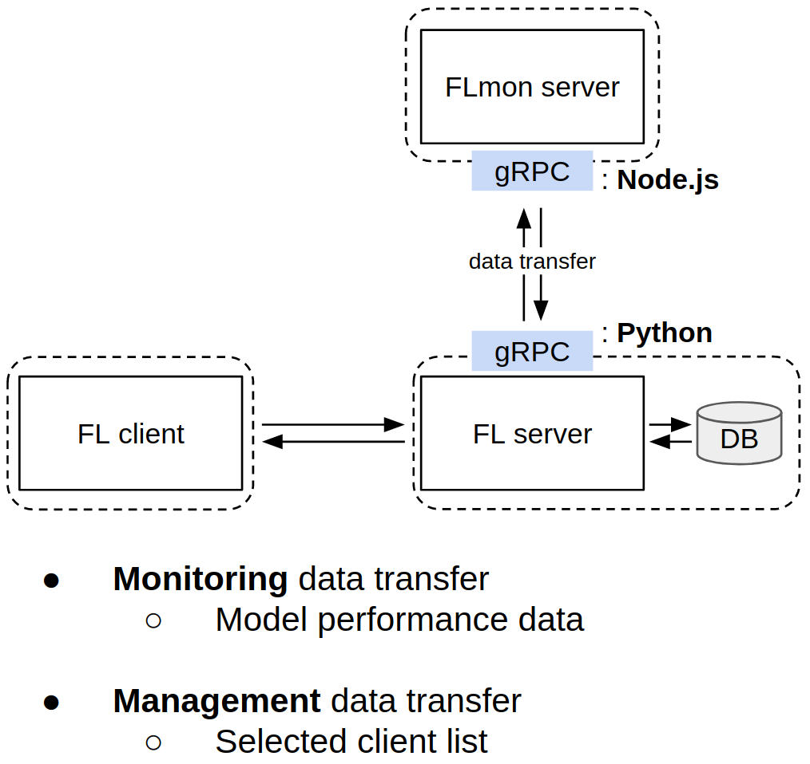
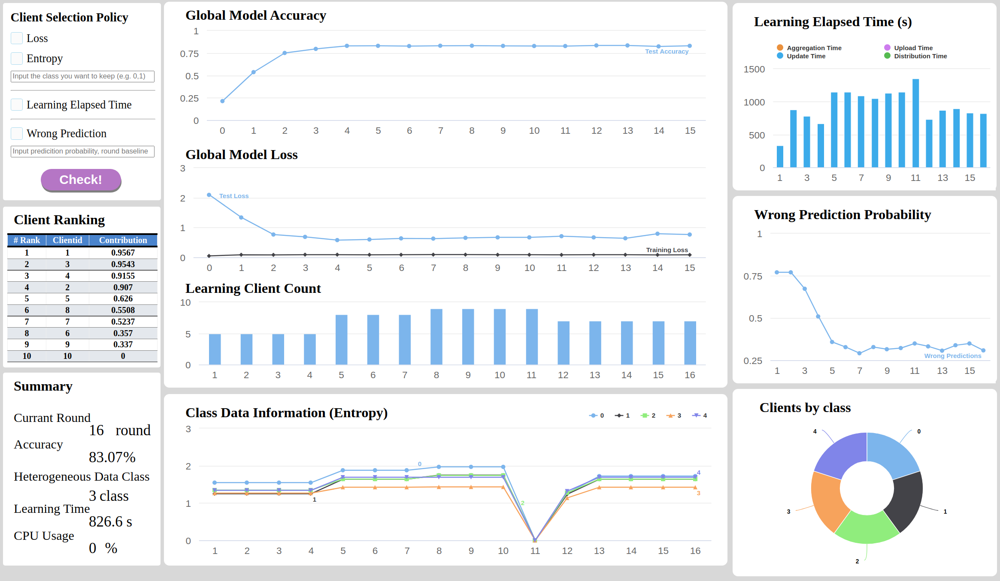

# FLmon
Federated Learning Management & Management Dashboard (FLmon). <br>
This dashboard was created to monitor and directly manage the performance of federated learning models. <br>
Information required for the dashboard is stored and used in the ```sqlite3``` database, indicating that it is still an early version. <br>
The dashboard communicates with the user's federated learning server using the``` gRPC communication protocol```.

## How to use
1. Performance database creation. (same environment as user's FL server)
2. Insert performance data into database.
3. Run ```server/FLmonServer.py``` (same environment as user's FL server)
4. Run ```index.js``` (desired FLmon environment)
5. Start federated learning!

## Location
- FLmon is <b>located in the different environment as user's federated learning server</b> and is a tool for federated learning users.



## Database
- index.db (Save the unique name of the client participating in federated learning by matching the index.)
```
CREATE TABLE ClientID (
    id INTEGER AUTO_INCREMENT PRIMARY KEY,
    clientname TEXT NOT NULL UNIQUE);
```
- learning.db (Save all data for performance monitoring.)
```
CREATE TABLE LearningRound (
    round INTEGER NOT NULL,
    clientid INTEGER NOT NULL,
    datasize TEXT NOT NULL,
    classsize TEXT NOT NULL);
CREATE TABLE LearningTime (
    round INTEGER NOT NULL,
    clientid INTEGER NOT NULL,
    uploadstarttime REAL NOT NULL,
    uploadendtime REAL NOT NULL);
CREATE TABLE DistributionTime (
    round INTEGER NOT NULL,
    clientid INTEGER NOT NULL,
    distributiontime REAL NOT NULL);
CREATE TABLE AggregationTime (
    round INTEGER NOT NULL,
    aggregationtime REAL NOT NULL);
CREATE TABLE LearningTrain (
    round INTEGER NOT NULL,
    clientid INTEGER NOT NULL,
    accuracy REAL NOT NULL,
    loss REAL NOT NULL,
    tloss REAL NOT NULL,
    trainingtime REAL NOT NULL);
CREATE TABLE Predictions (
    round INTEGER NOT NULL,
    clientid INTEGER NOT NULL,
    prediction REAL NOT NULL);
CREATE TABLE SelectionClient (
    round INTEGER NOT NULL,
    remove_client TEXT NOT NULL);
```

## Client Data for Performance Monitoring
- Description of the data to be stored in the database.
- FLmon server-side gRPC server transmits performance data to FLmon server-side gPRC server at the request of FLmon server.

|Data|Data Type|Database-Table|Description|
|:--:|:--:|:--:|:--:|
|client name|string|index-ClientID|Client name participating in learning.|
|data size|int32|learning-LearningRound|Data size by class.|
|class size|int32|learning-LearningRound|Class size by round.|
|test accuracy|float|learning-LearningTrain|Model test accuracy.|
|test loss|float|learning-LearningTrain|Model test loss.|
|train loss|float|learning-LearningTrain|Model train loss.|
|aggregation time|float|learning-AggregationTime|Model aggregation time.|
|upload end time|float|learning-LearningTime|Model upload end time.|
|upload start time|float|learning-LearningTime|Model upload start time.|
|update time|float|learning-LearningTrain|Model training time.|
|distribution time|float|learning-DistributionTime|Model distribution time.|

## Performance Management by Client Selection Method
- Manage performance data for the purpose of resolving 4 anomalies.
	- Overfitting Problem
	- Heterogeneous Data Problem
	- Long Training Time Problem
	- Anomaly Data Problem
- Select client from FLmon server and forward to FL server side gRPC server.

|Data|Data Type|Database-Table|Description|
|:--:|:--:|:--:|:--:|
|round|string|learning-SelectionClient|Current study round.|
|remove client|string|List of clients to exclude from training.|

## Performance Monitoring Interface

